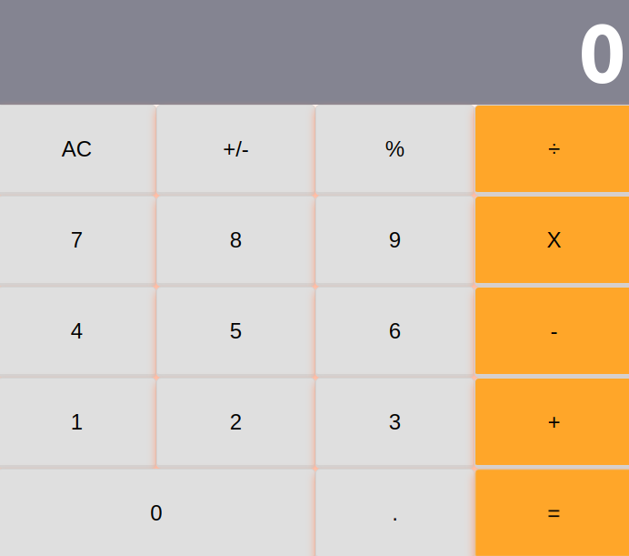

# Calculator App

> Calculator App built with React.js.

Calculator App buit using Rect.js

## Built With

- HTML, CSS
- React.js
- ES6 JavaScript

## Live Demo

[Live Demo Link](https://calculator-azeem.herokuapp.com/)

## Getting Started

To get a local copy up and running follow these simple example steps.

## Installation

To get a local copy up and running follow these simple example steps.

### Prerequisites

Have a browser installed

### Setup

Clone this repo with <code>git@github.com:Azeem838/calculator-app.git</code>

### Usage - Follow these

1. <code>cd</code> into the project directory
2. run <code>npm install</code>
3. Navigate to [localhost:8000](http://localhost:8000) in your browser.
4. Enjoy :smiley:

:bust_in_silhouette: **Azeem Ahmed**

- Github: [@Azeem838](https://github.com/Azeem838)
- LinkedIn: [Azeem Ahmed](www.linkedin.com/in/azeemmahmed)

## 🤝 Contributing

Contributions, issues, and feature requests are welcome!

Feel free to check the [issues page](https://github.com/Azeem838/calculator-app/issues).

## Show your support

Give a ⭐️ if you like this project!

## 📝 License

This project is [MIT](lic.url) licensed.
